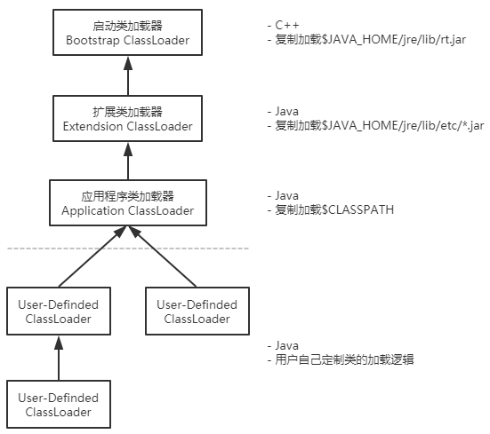

[toc]

# 类加载器ClassLoader
> 负责加签class文件<br>
> ClassLoader只负责class文件的加载，至于class文件能否运行，则由Execution Engine决定。

## 1、ClassLoader体系
<div style="text-align:center">



</div>

## 2、双亲委派机制&沙箱机制
> 双亲委派机制是一种组织类加载器之间关系的<b>一种规范</b>。

> 当某个类加载器接收当类加载的请求，它会直接委派为父加载器，这样层层递进，直到最顶层的类加载器处理该请求。

> 当父加载器无法处理该请求时（加载路径下不存在这个类时），该类加载器才会处理类加载请求。

优点：
> 防止串改已有的类（父加载器负责的加载路径下的类）

### 2.1、沙箱机制
> 基于双亲委派机制，父加载器的加载的类不对被子加载器加载的类所破坏。

## 3、验证
### 3.1、获取类加载器
``` java
public class ClassLoderTest {
    public static void main(String[] args) {
        // C++编写的类加载，JVM是获取不到的
        System.out.println(new ClassLoderTest().getClass().getClassLoader().getParent().getParent());
        System.out.println(new ClassLoderTest().getClass().getClassLoader().getParent());
        System.out.println(new ClassLoderTest().getClass().getClassLoader());
        System.out.println("=====================================");
        System.out.println(new Object().getClass().getClassLoader());
        System.out.println(new String().getClass().getClassLoader());
    }
}
```
``` java
// 运行结果
null
sun.misc.Launcher$ExtClassLoader@7852e922
sun.misc.Launcher$AppClassLoader@2a139a55
=====================================
null             // rt.jar的类由Bootstrap ClassLoader加载
null
```

### 3.2、验证双亲委派模型、验证沙箱机制
``` java
// 自定义了一个package，名称为java.lang
package java.lang;

// 在自定义的java.lang常见一个String类，并包含main方法
public class String {
    public static void main(String[] args) {
        System.out.println(new String().getClass().getClassLoader());
    }
}
```
``` log
错误: 在类 java.lang.String 中找不到 main 方法, 请将 main 方法定义为:
    public static void main(String[] args)
否则 JavaFX 应用程序类必须扩展javafx.application.Application
```

## 4、`Class.forName` & `classLoader#loadClass`
- `Class.forName` 静态方法，根据传入的类全限定名称，加载Class对象到内存，并执行类初始化操作。
- `classLoader#loadClass` 实例方法，根据传入的类全限定名称，加载Class对象到内存。

``` java
public class ClassLoderTest2 {
    public static void main(String[] args) throws Exception {
        // 分别运行test1和test2方法
        test1();
        // test2();
    }

    public static void test1() throws Exception {
        Class<?> clazz = ClassLoderTest2.class.getClassLoader().loadClass("com.xych.jvm.practice.ATest");
        System.out.println(clazz);
        Object obj = clazz.newInstance();
        System.out.println(obj);
    }

    public static void test2() throws Exception {
        Class<?> clazz = Class.forName("com.xych.jvm.practice.ATest");
        System.out.println(clazz);
        Object obj = clazz.newInstance();
        System.out.println(obj);
    }
}

class ATest {
    static {
        System.out.println("class static code");
    }
}
```
- test1运行结果
    ``` log
    class com.xych.jvm.practice.ATest
    class static code
    com.xych.jvm.practice.ATest@7852e922
    ```
- test2运行结果
    ``` log
    class static code
    class com.xych.jvm.practice.ATest
    com.xych.jvm.practice.ATest@7852e922
    ```
    