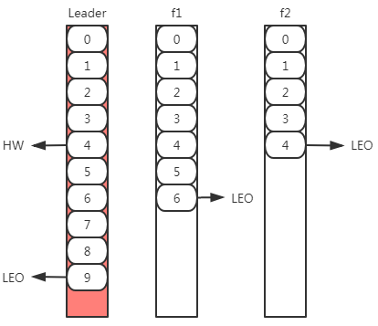
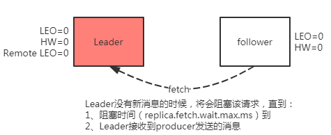
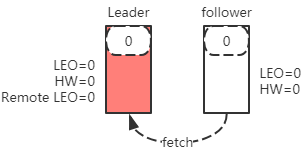
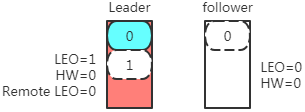
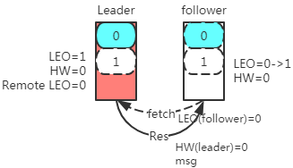
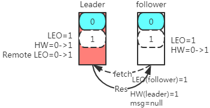

[toc]

# Kafka副本数据同步

## 1、概念

### 1.1、`LEO`
> 日志末端偏移量。log end offset。 
> 记录了该副本底层日志(log)中下一条消息的位移值。注意是下一条消息！

eg：如果LEO=10，那么表示存储了10条消息，偏移量范围为[0,9]，

### 1.2、`HW`
> 高水位值（Hight Water）。 
> 表示已确认消息的偏移量，也表示消费者最多消费的消息数量。 
> 小于等于HW值的所有消息都被认为是“已备份”的（replicated）。 
> HW <= LEO

## 2、数据同步
### 2.1、初始状态
> 初始状态下，leader和follower的HW和LEO都是0；leader副本会保存remote LEO，表示所有follower LEO，也会被初始化为0；

> 这个时候，producer没有发送消息。

> follower会不断地个leader发送FETCH请求，但是因为没有数据，这个请求会被leader寄存，当在指定的时间之后会强制完成请求，这个时间配置是(`replica.fetch.wait.max.ms`)。如果在指定时间内producer有消息发送过来，那么kafka会唤醒fetch请求，让leader继续处理。

- LEO、HW、Remote LEO更新：
    - Leader端
        - LEO：新消息进入log日志，加1
        - remote.LEO = follower发起fetch携带的follower.LEO
        - `leader.HW = min(leader.LEO, remote.LEO)`
    - Follower端
        - LEO：新消息进入log日志，加1
        - `follower.HW = min(follower.LEO, leader.HW)`

 

- 数据的同步处理会分两种情况:
    - 第一种是leader处理完producer请求之后，follower发送一个fetch请求过来。
    - 第二种是follower阻塞在leader指定时间之内，leader副本收到producer的请求。

### 2.2、第一种情况
> leader处理完producer请求之后，follower发送一个fetch请求过来。

步骤|图|讲解
:-|:-:|:-
初始状态|&nbsp;|&nbsp;
producer 发送一条消息|&nbsp;|Leader端： &nbsp;&nbsp;&nbsp;&nbsp;1. 将消息追加到log文件，更新`LEO=1` &nbsp;&nbsp;&nbsp;&nbsp;2. 更新`leader.HW = min(leader.LEO, remote.LEO)`=0
follower 发起fetch请求|&nbsp;|1、Leader端（收到fetch请求之后）： &nbsp;&nbsp;&nbsp;&nbsp;1.1、更新`remote.LEO=fetch请求携带的follower.LEO`=0 &nbsp;&nbsp;&nbsp;&nbsp;2.2、更新`leader.HW = min(leader.LEO, remote.LEO)`=0 &nbsp;&nbsp;&nbsp;&nbsp;2.3、准备响应数据（消息内容、`leader.HW`） 2、Follower端（获取响应之后）： &nbsp;&nbsp;&nbsp;&nbsp;2.1、将消息追加到log文件，更新LEO=1 &nbsp;&nbsp;&nbsp;&nbsp;2.2、更新`follower.HW = min(follower.LEO, leader.HW)`=0
follower <b>再次</b> 发起fetch请求|&nbsp;|1、Leader端（收到fetch请求之后）： &nbsp;&nbsp;&nbsp;&nbsp;1.1、更新`remote.LEO=fetch请求携带的follower.LEO`=1 &nbsp;&nbsp;&nbsp;&nbsp;2.2、更新`leader.HW = min(leader.LEO, remote.LEO)`=1 &nbsp;&nbsp;&nbsp;&nbsp;2.3、准备响应数据（`leader.HW`） 2、Follower端（获取响应之后）： &nbsp;&nbsp;&nbsp;&nbsp;2.1、消息为null，不更新LEO &nbsp;&nbsp;&nbsp;&nbsp;2.2、更新`follower.HW = min(follower.LEO, leader.HW)`=1

### 2.3、第二种情况
> follower阻塞在leader指定时间之内，leader副本收到producer的请求。

> 过程基本和第一种情况一致。
